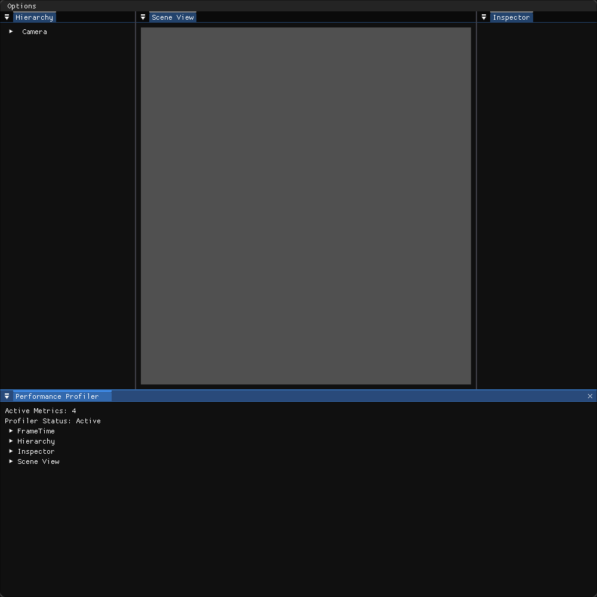

# About
this is a Unity-Like Raylib C# engine I'm building for architecture practice, it uses rlImGui-cs and ImGuiNET along with Raylib-cs. Currently i am still yet to display anything.

## Features
- Hierarchy
- Transform2D
- Component System
- Dockable ImGui Windows
## TODO
- second revision of rendererComponent2D, Transform2D, and hierarchy systems as they work together.
- seperate editor logic and scene logic better.
